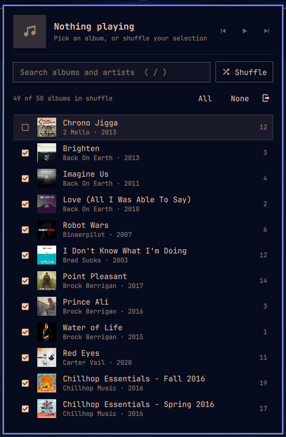

# omarchy-navidrome



Navidrome (or any Subsonic server) in the Omarchy bar. Browse albums, play an album or a track, or shuffle songs from the albums you've checked.

- Plays through a headless `mpv`, so media keys and MPRIS work through Omarchy's `mpv-mpris`
- The library loads once when the shell starts and stays in memory. Search filters on each keystroke. The list only renders visible rows.
- Shuffle picks songs evenly at random across the checked albums. It skips recent repeats and queues the next track early so there's no gap. Every album starts checked.
- Stores only the salted Subsonic token, never your password, in `~/.config/omarchy/navidrome.json` (mode 600)

## Requirements

- `mpv` (plays audio; preinstalled on Omarchy)
- `mpv-mpris` (optional, ships with Omarchy) for media keys and the media widget

## Install

```bash
omarchy plugin add https://github.com/backmeupplz/omarchy-navidrome.git --enable
```

Click the ♫ icon in the bar, then enter your server URL, username and password.

## Remove

```bash
omarchy plugin remove backmeupplz.navidrome
rm ~/.config/omarchy/navidrome.json   # saved server, token and album selection
```

## Keys (panel open)

| Key | Action |
|-----|--------|
| `j`/`k`, arrows | move |
| `Enter`/`l` | open album, or play a track |
| `Esc`/`h` | back, or close |
| `Space` | check or uncheck an album for shuffle |
| `/` | search |
| `s` | shuffle checked albums |
| `p` / `n` / `b` | pause / next / previous |
| `r` | reload library |

Middle-click the bar icon to pause.

## Keybinds

```bash
omarchy-shell backmeupplz.navidrome toggle   # open/close the panel
omarchy-shell navidrome shuffle
omarchy-shell navidrome toggle               # play/pause
omarchy-shell navidrome next
omarchy-shell navidrome previous
omarchy-shell navidrome status               # JSON
```

## Development

`node test.js` runs the shuffle-picking check. The service has `keepLoaded`, so edits to `Service.qml` need `omarchy restart shell`.

## License

MIT
